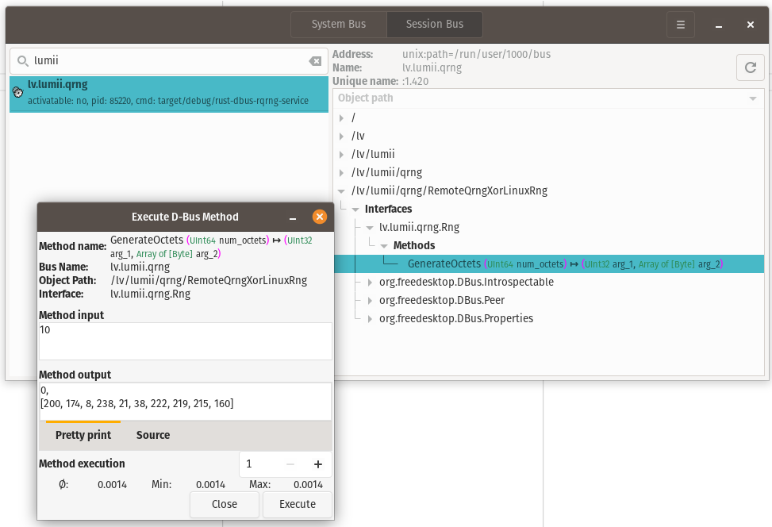

# TRNG D-Bus

True random number generator (TRNG) D-Bus service.

Written primarily for Linux in Rust using [zbus](https://github.com/dbus2/zbus) library.
It serves as a gateway for cryptographic applications to retrieve
(in a buffered, safe and authenticated manner)
data from hardware RNG devices, both local or remote.

Quick-start & development:
```bash
cargo run
```

## Build & install

Script to automate building and installation: `scripts/install.sh`.

I. Build the binary

```bash
cargo build --release
```

II. Place binary at a well-known path (hard link to ~/.local/bin)

```bash
mkdir -p ~/.local/bin
ln -f target/release/trngdbus ~/.local/bin/trngdbus
```

> user-specific executable files may be stored in $HOME/.local/bin.
~ [XDG Base Directory Spec](https://specifications.freedesktop.org/basedir-spec/latest/)

III. Create the D-Bus activation file pointing to that path

```bash
mkdir -p ~/.local/share/dbus-1/services
cat > ~/.local/share/dbus-1/services/lv.lumii.qrng.service <<EOF
[D-BUS Service]
Name=lv.lumii.qrng
Exec=$HOME/.local/bin/trngdbus
EOF
```

> On Unix, the standard session service directories are
> `$XDG_DATA_HOME/dbus-1/services`, where `XDG_DATA_HOME` defaults to `~/.local/share`
~ [D-Bus Specification](https://dbus.freedesktop.org/doc/dbus-daemon.1.html)

IV. Reload D-Bus service files (no logout needed)
```bash
busctl --user call org.freedesktop.DBus / org.freedesktop.DBus ReloadConfig
```
Now the service will be auto-started on the first session-bus request to `lv.lumii.qrng`.
D-Bus does not monitor service dir, we must notify it that it has changed.


## Calling with busctl

These calls auto-start the service if it's not already running.

- Introspect to see the interface and methods
  ```bash
  busctl --user introspect lv.lumii.qrng /lv/lumii/qrng/RemoteQrngXorLinuxRng
  ```

TODO: we changed the signature of the method, so we need to update the examples.

- Call `GenerateOctets(num_bytes)` on interface `lv.lumii.qrng.Rng`
  (use DBus type `t` for 64-bit unsigned on most systems)
  ```bash
  busctl --user call \
    lv.lumii.qrng \
    /lv/lumii/qrng/RemoteQrngXorLinuxRng \
    lv.lumii.qrng.Rng \
    GenerateOctets \
    t 32
  ```

- Call `GenerateOctetsTimeout(num_bytes, timeout_ms)` on interface `lv.lumii.qrng.Rng`
  ```bash
  busctl --user call \
    lv.lumii.qrng \
    /lv/lumii/qrng/RemoteQrngXorLinuxRng \
    lv.lumii.qrng.Rng \
    GenerateOctetsTimeout \
    tt 32 500
  ```

If you previously got an error like "Too few parameters for signature", ensure you pass INTERFACE and METHOD as separate arguments (as above) and include the correct signature (`t` for each 64-bit unsigned integer on 64-bit systems).

## Recompile & restart

After source code updates or `.toml` config change: `scripts/restart.sh`.

I. Recompile the binary
```bash
cargo build --release
ln -f target/release/trngdbus ~/.local/bin/trngdbus
```

II. Find out the PID and kill it
```bash
busctl --user status lv.lumii.qrng
OUT=$(busctl --user status lv.lumii.qrng 2>/dev/null)
export PID=$(echo "$OUT" | grep "^PID=" | cut -c 5-)
if [ -n "$PID" ]; then
  kill $PID
fi
```

The next D-Bus request will auto-start the service again.

## Core algorithm

Generate command:
1. load entropy sources from .toml file in `/etc/trng-dbus/config.toml`
2. for a request, read the requested number of bytes from each enabled source
3. await responses from source type handlers, then XOR results and return

Generate also takes a timeout parameter. In that case:
1. it is passed to the source type handlers
2. source type handlers return as much bytes as they can in the given time
3. aggregator XORs the longest common (in terms of length) prefix

Entropy source may be buffered. In that case:
1. it is replenished in the background until buffer is full
2. leftover bytes are returned to the buffer

## D-Bus information

- Bus name: `lv.lumii.qrng` (session bus)
- Object path: `/lv/lumii/qrng/SourceXorAggregator`
- Interface: `lv.lumii.qrng.Rng`
- Generate(num_bytes: u64) -> (status: u32, bytes: [u8])

## Configuration (TOML)

Default path: `/etc/trng-dbus/config.toml`
Example: `docs/example.toml`

```toml
[[sources]]
combine = "xor"

[[sources.lrng]]
key = "linux-dev-random"
enabled = false

[[sources.file]]
key = "idq-quantis"
path = "/dev/qrandom0"
enabled = false

[[sources.file]]
key = "some-file"
path = "some_file.bin"
loop = true
enabled = true
```

Notes:
- `combine` currently supports `xor`.
- `lrng` denotes Linux kernel RNG;
- `file` denotes a byte stream from a file/device.
- When `loop=true`, the file restarts from the beginning at EOF.

## D-Feet GUI

D-Feet can be used to inspect D-Bus interfaces of running programs and invoke methods on those interfaces



## Roadmap

Add support for retrieving data from [qrng-web-service](https://github.com/LUMII-Syslab/qrng-web-service).

## Related

Related GitHub repositories
- [c-rqrng-dbus-client](https://github.com/KrisjanisP/c-rqrng-dbus-client) sample C code for retrieving data
- [rqrng-dbus-openssl-provider](https://github.com/KrisjanisP/rqrng-dbus-openssl-provider) attempt to integrate into OpenSSL
