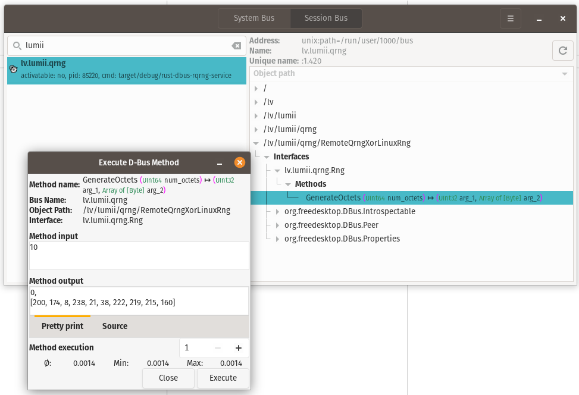

Remote QRNG (RQRNG) service is written for Linux in Rust using zbus library

---

Start service with
```
cargo run
```

D-Feet can be used to inspect D-Bus interfaces of running programs and invoke methods on those interfaces




---

Related GitHub repositories
- [c-rqrng-dbus-client](https://github.com/KrisjanisP/c-rqrng-dbus-client) sample C code for retrieving data
- [rqrng-dbus-openssl-provider](https://github.com/KrisjanisP/rqrng-dbus-openssl-provider) attempt to integrate into OpenSSL
